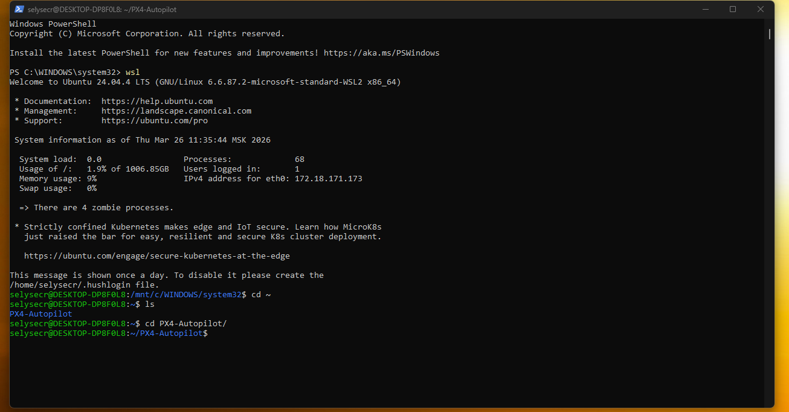
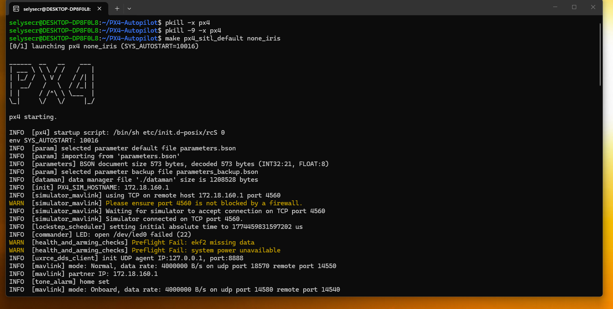
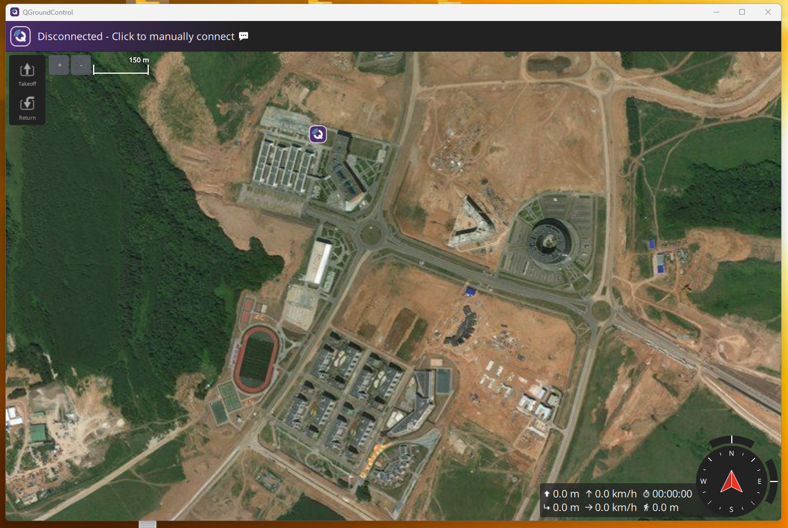
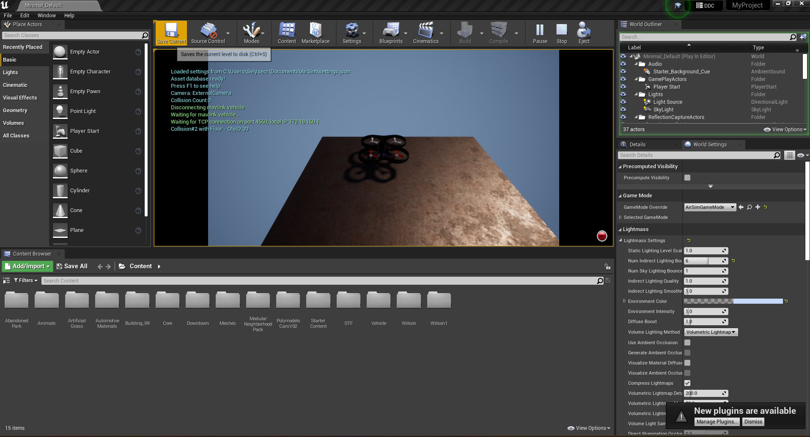

# HW_1 - Project start, setup, and installation evidence

## 1) Project idea from the beginning

This homework documents the **start of the project**: building a full simulation environment for autonomous drone research before moving to advanced coding and ML.

Main idea:
- run drone autopilot in simulation (PX4 SITL),
- connect a ground station (QGroundControl),
- run the simulator scene in Unreal + AirSim,
- prepare a clean Python environment for later CV/ML work.

This phase is focused on **infrastructure and readiness**, not final algorithm results.

Local report in this folder:
- `[HW1] Research Topic and Conference Selection.pdf`

---

## 2) Software installed in HW_1

| Tool | Why it was needed |
|------|--------------------|
| **WSL2** | Linux environment for PX4 build and SITL |
| **PX4-Autopilot** | Core autopilot stack |
| **QGroundControl** | Mission planner and telemetry UI |
| **Unreal Engine** | 3D simulator host |
| **AirSim plugin** | Bridge between Unreal and drone APIs |
| **Python 3.10 + venv** | Runtime for scripts and automation |
| **Git/GitHub** | Version control and submission |

---

## 3) Installation code notebook

All setup commands for this stage are collected in:
- `install.ipynb`

The notebook includes:
- WSL checks,
- PX4 clone/build commands,
- QGroundControl install notes,
- Unreal + AirSim integration checklist,
- Python environment setup commands.

---

## 4) Diagrams (simplified)

| File | Description |
|------|-------------|
| [diagrams/01_system_context.md](diagrams/01_system_context.md) | Simple component interaction diagram |
| [diagrams/02_dev_environment.md](diagrams/02_dev_environment.md) | Clear host/WSL split and data flow |

---

## 5) Shared image evidence (ALL_HW/images)


- `../images/install_wsl.png`
- `../images/install_px4.png`
- `../images/install_qgroundcontrol.png`
- `../images/install_unreal.png`


```markdown

```

### Installation evidence gallery






---

## 6) HW_1 completion checklist

- [x] Research topic PDF included
- [x] Setup narrative documented
- [x] Install commands gathered in `install.ipynb`
- [x] Diagrams simplified for readability
- [ ] Final screenshots linked from `ALL_HW/images`
