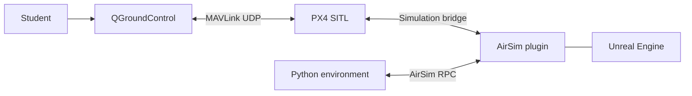

# HW_1 system context (clean version)

```mermaid
flowchart LR
  USER[Student]
  QGC[QGroundControl]
  PX4[PX4 SITL]
  UE[Unreal Engine]
  AS[AirSim plugin]
  PY[Python environment]

  USER --> QGC
  QGC <-->|MAVLink UDP| PX4
  PX4 <-->|Simulation bridge| AS
  AS --- UE
  PY <-->|AirSim RPC| AS
```

Caption: HW_1 establishes communication paths between control software, simulator, and the Python environment.
