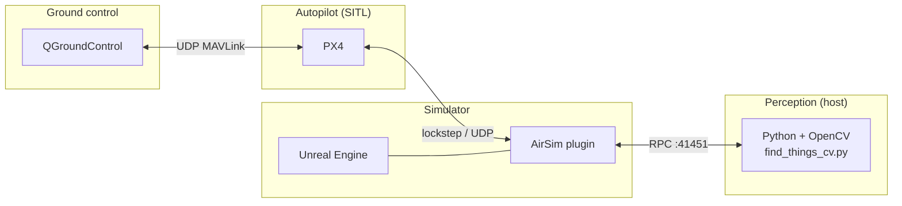

# System context (Mermaid)

Render in GitHub, VS Code (Mermaid extension), or https://mermaid.live .

**Caption for report:** QGroundControl commands PX4; AirSim exchanges physics/autopilot data with PX4; the Python client uses AirSim’s RPC API for images and detections.
