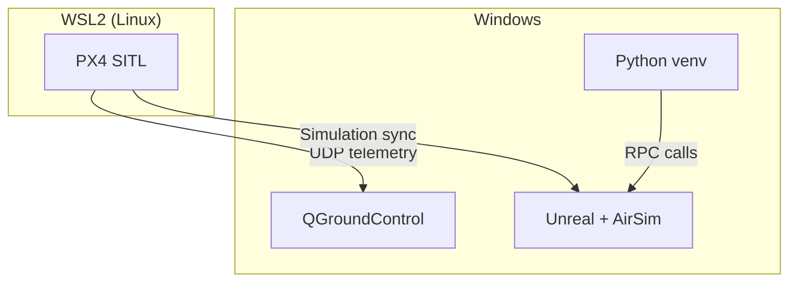

# HW_1 development topology (Windows + WSL)

```mermaid
flowchart TB
  subgraph WIN["Windows"]
    QGC["QGroundControl"]
    UE["Unreal + AirSim"]
    PY["Python venv"]
  end

  subgraph WSL["WSL2 (Linux)"]
    PX4["PX4 SITL"]
  end

  PX4 -->|UDP telemetry| QGC
  PX4 -->|Simulation sync| UE
  PY -->|RPC calls| UE
```

Note: use your real IP and port values in the report appendix.
