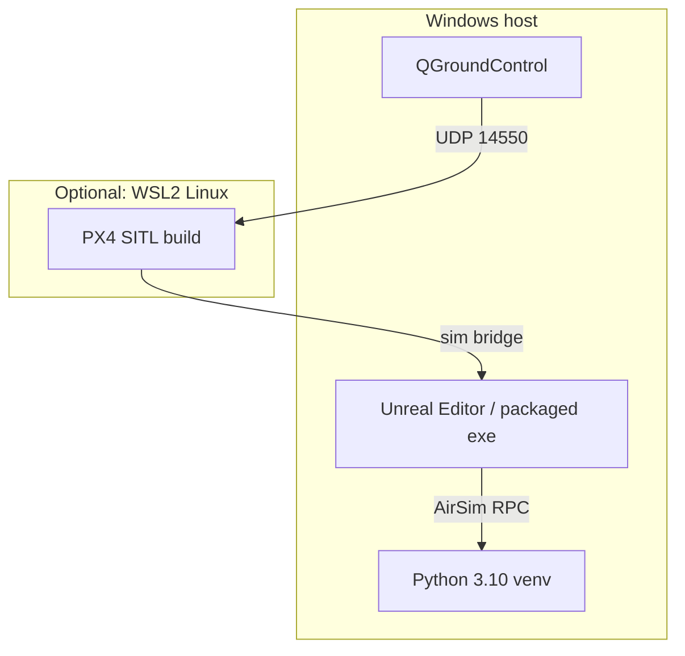

# Development environment topology

```mermaid
flowchart TB
  subgraph WIN["Windows host"]
    UE["Unreal Editor / packaged exe"]
    PY["Python 3.10 venv"]
    QGC["QGroundControl"]
  end
  subgraph WSL["Optional: WSL2 Linux"]
    PX4["PX4 SITL build"]
  end
  QGC -->|UDP 14550| PX4
  UE -->|AirSim RPC| PY
  PX4 -->|sim bridge| UE
```

**Student note:** Replace WSL IP / `PX4_SIM_HOST_ADDR` with **your** network notes when you document reproduction steps.
