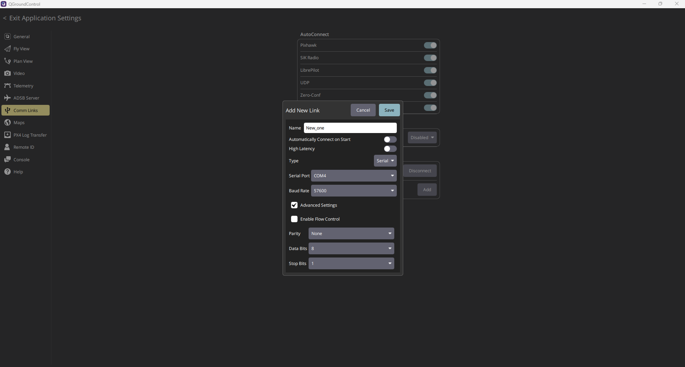
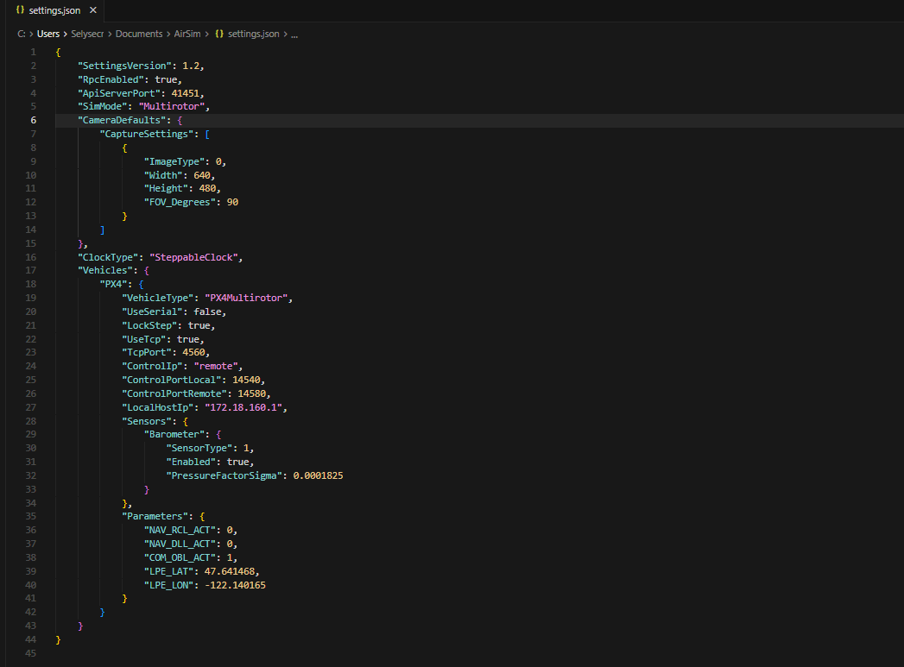

# HW_2 — Communication architecture and connection setup

## Objective of this homework

In HW_2, the focus is the **communication layer**: how we established a reliable link between:

- **PX4 SITL** (running in WSL),
- **QGroundControl** (running on Windows),
- **Unreal + AirSim** simulator,
- and AirSim configuration via `settings.json`.

This stage is critical because all later CV/ML work depends on stable telemetry, control, and simulator synchronization.

---

## 1) Main artifacts in this folder

- `[HW2] Update on Research Topic and Conference Selection.pdf`
- This README (technical explanation of network and links)
- Diagrams in `diagrams/`
- Evidence images in shared folder `../images/`

---

## 2) QGroundControl Comm Links configuration

We configured communication links in QGroundControl from:
- `Application Settings -> Comm Links`.

The idea is to ensure QGC can receive MAVLink stream(s) from PX4 SITL and maintain a stable control/telemetry session.

### Evidence image



### Notes

- In simulator workflows, **UDP links** are usually preferred.
- The COM/Serial form may still appear in UI; the final setup should match the active PX4 stream mode.
- Link settings (port/auto-connect) must match the MAVLink endpoints opened in PX4.

---

## 3) AirSim settings file used for connection

We created and tuned:

- `C:\Users\Selysecr\Documents\AirSim\settings.json`

### Evidence image



### Key fields and why they matter

From the configured file:

- `ApiServerPort: 41451`  
  AirSim RPC endpoint used by Python clients and tools.

- `SimMode: "Multirotor"`  
  Enables drone simulation mode.

- `ClockType: "SteppableClock"` + `LockStep: true`  
  Improves deterministic interaction between PX4 SITL and simulator timing.

- Vehicle block (`"PX4"`):
  - `VehicleType: "PX4Multirotor"`
  - `UseTcp: true`
  - `TcpPort: 4560`
  - `ControlPortLocal: 14540`
  - `ControlPortRemote: 14580`
  - `LocalHostIp: "172.18.160.1"` (Windows host IP reachable from WSL)

These values define the network bridge between the simulator side (Windows/Unreal) and PX4 side (WSL).

---

## 4) PX4 MAVLink streams used

We started MAVLink endpoints in PX4 shell (`pxh`) with:

```text
pxh> mavlink stop-all
pxh> mavlink start -x -u 18570 -r 4000000 -f -p
pxh> mavlink start -x -u 14580 -r 4000000 -f
pxh> mavlink start -x -u 14280 -r 4000
pxh> mavlink start -x -u 13030 -r 400000
```

### Why this matters

- `mavlink stop-all` clears stale streams and avoids port conflicts.
- Multiple `mavlink start` commands allow different consumers/rates (GCS, simulator bridge, telemetry/debug).
- Port consistency with QGC and AirSim settings is the key to successful connection.

---

## 5) How full connection was established (end-to-end)

Typical startup sequence:

1. Start **PX4 SITL** in WSL.
2. Launch **Unreal project** with AirSim plugin and press **Play**.
3. Open **QGroundControl**, configure/verify Comm Link(s).
4. Ensure `settings.json` values match host networking (especially `LocalHostIp` and ports).
5. Start/restart MAVLink streams from `pxh` as shown above.
6. Verify:
   - QGC receives heartbeat/telemetry,
   - Unreal/AirSim remains synchronized with PX4,
   - no conflicting port bindings.

---

## 6) Networking explanation (WSL + Windows + simulator)

This setup spans two network contexts:

- **WSL (Linux side):** PX4 SITL process.
- **Windows side:** Unreal + AirSim + QGroundControl.

Because of this split, the host IP and UDP/TCP ports must be explicitly aligned.  
A mismatch in one place (QGC link, AirSim JSON, or PX4 MAVLink port) is enough to break communication.

---

## 7) Diagrams

| File | Description |
|------|-------------|
| [diagrams/01_research_timeline.md](diagrams/01_research_timeline.md) | HW milestone timeline |
| [diagrams/02_comm_links_architecture.md](diagrams/02_comm_links_architecture.md) | QGC, PX4, Unreal, AirSim architecture |
| [diagrams/03_mavlink_port_flow.md](diagrams/03_mavlink_port_flow.md) | MAVLink port-level flow from `pxh` commands |

---

## 8) Troubleshooting used in this stage

- If QGC does not connect: verify active link type/port in Comm Links and restart QGC.
- If Unreal is running but no control sync: verify AirSim plugin enabled and project is in **Play** mode.
- If API clients fail: verify `ApiServerPort` and `RpcEnabled` in `settings.json`.
- If random disconnects happen: run `mavlink stop-all` then re-run the exact `mavlink start` sequence.

---

## 9) Checklist for HW_2 submission

- [x] Explain Comm Links setup in QGroundControl
- [x] Include `settings.json` role and key fields
- [x] Include PX4 `mavlink` command sequence
- [x] Explain full WSL-PX4-Unreal-QGC connection path
- [x] Add evidence images from `ALL_HW/images`
