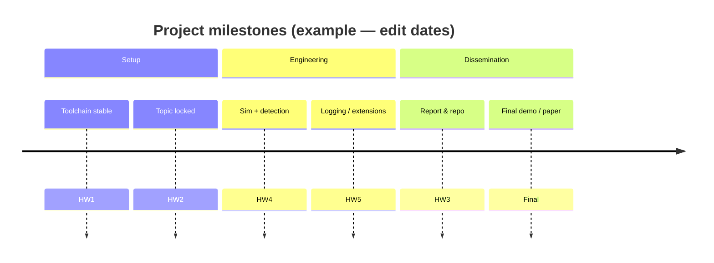

# Research / implementation timeline

```mermaid
timeline
  title Project milestones (example — edit dates)
  section Setup
    Toolchain stable    : HW1
    Topic locked          : HW2
  section Engineering
    Sim + detection      : HW4
    Logging / extensions : HW5
  section Dissemination
    Report & repo        : HW3
    Final demo / paper   : Final
```

For a simpler Gantt-style view, use a table in README instead.
