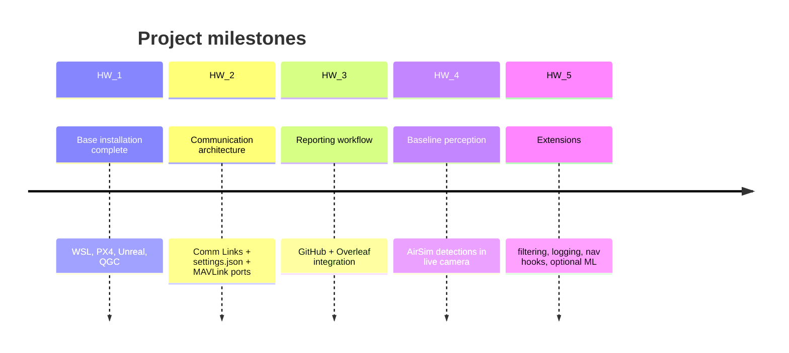

# HW timeline (connectivity-focused revision)

```mermaid
timeline
  title Project milestones
  section HW_1
    Base installation complete : WSL, PX4, Unreal, QGC
  section HW_2
    Communication architecture : Comm Links + settings.json + MAVLink ports
  section HW_3
    Reporting workflow         : GitHub + Overleaf integration
  section HW_4
    Baseline perception        : AirSim detections in live camera
  section HW_5
    Extensions                 : filtering, logging, nav hooks, optional ML
```
