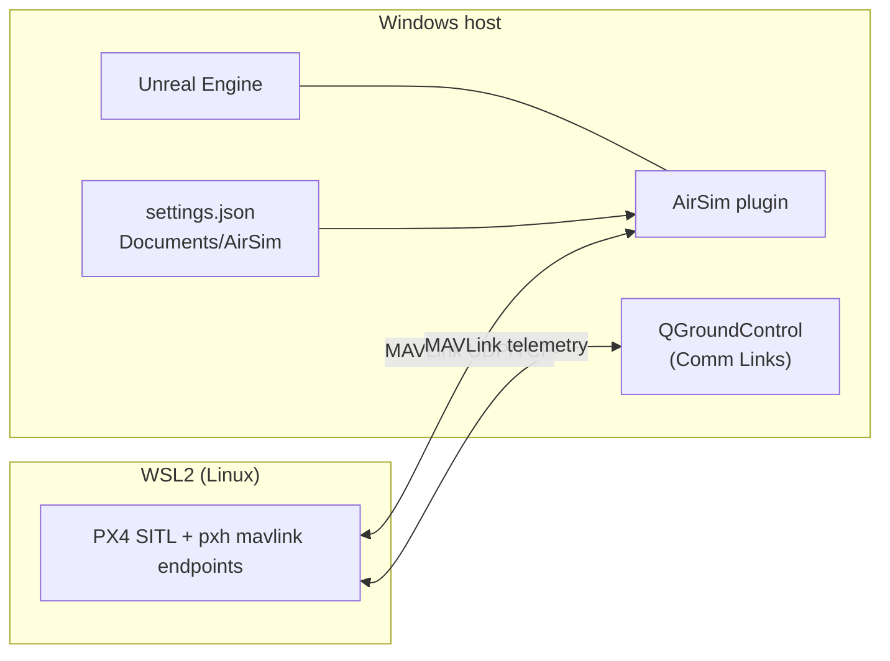

# HW_2 communication architecture

```mermaid
flowchart LR
  subgraph WSL["WSL2 (Linux)"]
    PX4["PX4 SITL + pxh mavlink endpoints"]
  end

  subgraph WIN["Windows host"]
    QGC["QGroundControl\n(Comm Links)"]
    UE["Unreal Engine"]
    AS["AirSim plugin"]
    JSON["settings.json\nDocuments/AirSim"]
  end

  JSON --> AS
  UE --- AS
  PX4 <-->|MAVLink UDP/TCP| AS
  PX4 <-->|MAVLink telemetry| QGC
```

Caption: `settings.json` configures AirSim networking and PX4 vehicle mode; QGroundControl and AirSim both consume PX4 MAVLink streams.
