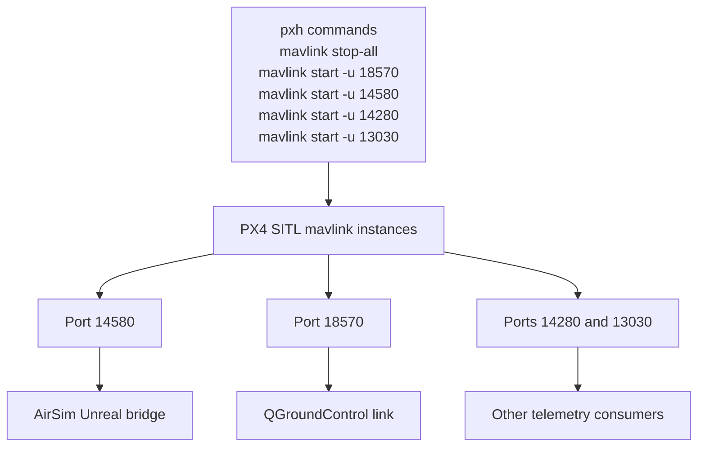

# HW_2 MAVLink port flow (from pxh commands)

Notes:
- Exact consumer-to-port mapping depends on your runtime link setup.
- The important principle is to keep **QGC link ports**, **AirSim settings**, and **PX4 mavlink starts** consistent.
