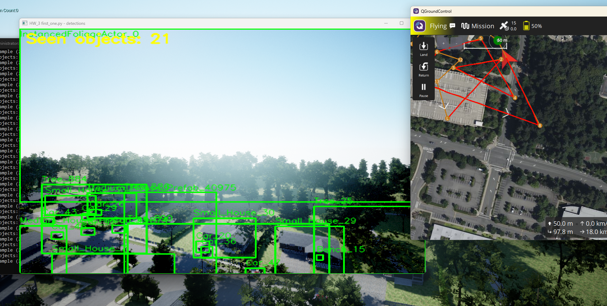
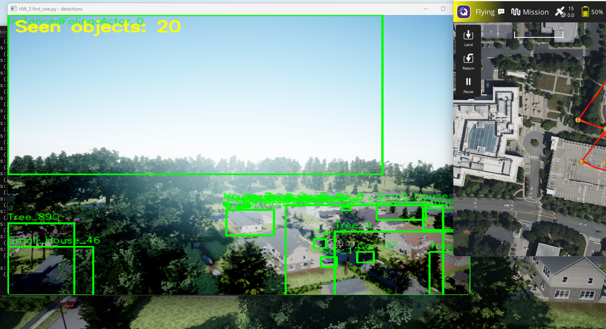
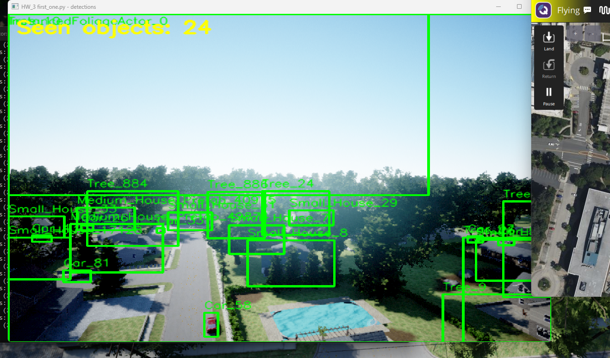
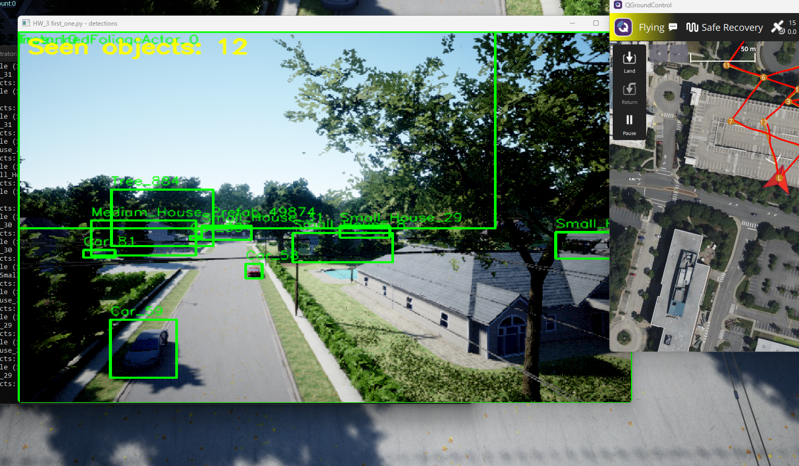
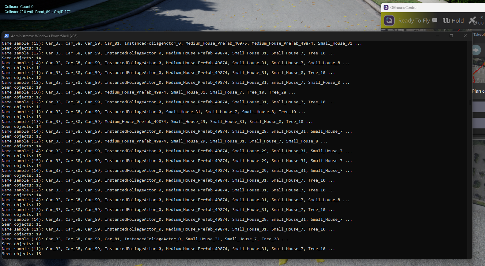

# HW_3 — First object-detection program (`first_one.py`)

## Objective

Build and run the **first simple detection program** while the drone flies in simulation:

- read live drone camera frames from AirSim,
- detect objects by AirSim detection filters,
- draw object boxes + names,
- display the total number of seen objects in real time.

This homework is the first practical CV integration milestone after communication setup in HW_2.

---

## 1) Main files in HW_3

| File | Purpose |
|------|---------|
| `first_one.py` | Starter real-time detector script |
| `diagrams/02_runtime_communication.md` | End-to-end system communication |
| `diagrams/03_first_one_flow.md` | Code processing loop |
| `[HW3] Github_Overleaf_Report.pdf` | Course PDF deliverable |

---

## 2) How communication is established (PX4, AirSim, Unreal, QGroundControl)

### Components

- **PX4 SITL (WSL):** autopilot process.
- **Unreal + AirSim (Windows):** simulator world + drone plugin.
- **QGroundControl (Windows):** mission/telemetry interface.
- **`first_one.py` (Windows):** vision script using AirSim RPC API.

### Data and control paths

1. **PX4 <-> AirSim/Unreal:** MAVLink/bridge synchronization for simulated flight.
2. **PX4 <-> QGroundControl:** telemetry and control link.
3. **Python <-> AirSim:** RPC calls (default `127.0.0.1:41451`) for camera images and detections.

### Required startup order

1. Start PX4 SITL (WSL).
2. Open Unreal project and press Play.
3. Open QGroundControl and confirm connection.
4. Run `first_one.py`.

---

## 3) What `first_one.py` does (plain English)

The script is a **live viewer** for the drone’s camera with **AirSim’s built-in object detection**:

1. Unreal/AirSim simulates the world and the drone; the **front camera** produces images.
2. AirSim can return a list of **2D bounding boxes** for actors whose **names in the level** match patterns like `Car*` (this is not a neural network; the simulator knows object meshes/names).
3. The script **draws** those boxes and labels on each frame with OpenCV and shows **how many** objects were returned this frame (`Seen objects: N`).
4. While you fly with PX4 + QGroundControl, the camera moves, so counts and boxes **change** as new objects enter the view.

Source file: `ALL_HW/HW_3/first_one.py`.

---

## 4) Run instructions

From repository root (`Drons`):

```powershell
cd c:\Users\Selysecr\Desktop\Drons
.\AirSim\PythonClient\detection\venv310\Scripts\python.exe ALL_HW\HW_3\first_one.py
```

Expected output:
- Terminal: `Connected to AirSim.`, then `Seen objects: ...`
- OpenCV window: live frame with object boxes and labels.

---

## 5) Reading `first_one.py` top to bottom (for the instructor / TA)

### 5.1 Imports and AirSim path (`sys.path`)

The folder `AirSim/PythonClient` is added to `sys.path` so Python can `import airsim` from your repo **without** installing AirSim as a separate pip package.  
`ROOT` is two levels up from `ALL_HW/HW_3/`, i.e. the `Drons` repository root.

```20:26:c:\Users\Selysecr\Desktop\Drons\ALL_HW\HW_3\first_one.py
# Make local AirSim Python package importable without installing globally.
ROOT = os.path.abspath(os.path.join(os.path.dirname(__file__), "..", ".."))
PYCLIENT = os.path.join(ROOT, "AirSim", "PythonClient")
if PYCLIENT not in sys.path:
    sys.path.insert(0, PYCLIENT)

import airsim  # noqa: E402
```

---

### 5.2 Connection settings (must match your simulator)

These constants tell the client **where** AirSim listens for Python API calls (RPC):

| Name | Typical value | Meaning |
|------|----------------|--------|
| `AIRSIM_IP` | `127.0.0.1` | Same machine as Unreal |
| `AIRSIM_PORT` | `41451` | Must match `ApiServerPort` in `Documents\AirSim\settings.json` |
| `CAMERA_NAME` | `"0"` | Front-center camera id used by AirSim |
| `IMAGE_TYPE` | `Scene` | Normal RGB-style camera image |
| `DETECTION_RADIUS_CM` | `200 * 100` | Objects farther than this are ignored for detection |
| `WINDOW_NAME` | string | Title of the OpenCV window |

```29:34:c:\Users\Selysecr\Desktop\Drons\ALL_HW\HW_3\first_one.py
AIRSIM_IP = "127.0.0.1"
AIRSIM_PORT = 41451
CAMERA_NAME = "0"
IMAGE_TYPE = airsim.ImageType.Scene
DETECTION_RADIUS_CM = 200 * 100
WINDOW_NAME = "HW_3 first_one.py - detections"
```

---

### 5.3 Which objects to detect (wildcard list)

AirSim filters detections by **actor/mesh name prefix** in the Unreal World Outliner, not by color.

- **Default list** targets a suburban NH-style map: cars, houses, small houses, trees, benches, birch trees.
- **`AIRSIM_DETECT_FILTERS`** (environment variable) lets you override the list without editing the file: comma-separated patterns.

```36:55:c:\Users\Selysecr\Desktop\Drons\ALL_HW\HW_3\first_one.py
DEFAULT_OBJECTS_TO_FIND = [
    "Car*",
    "House*",
    "Small*",   # e.g. Small House_3
    "Tree*",
    "Bench*",
    "Birch*",   # Birch_01_160, Birch_10, ...
]


def objects_to_find():
    env = os.environ.get("AIRSIM_DETECT_FILTERS", "").strip()
    if not env:
        return list(DEFAULT_OBJECTS_TO_FIND)
    parts = [p.strip() for p in env.split(",") if p.strip()]
    return parts if parts else list(DEFAULT_OBJECTS_TO_FIND)
```

PowerShell example:

```powershell
$env:AIRSIM_DETECT_FILTERS="Car*,Bench*,Birch*"
```

---

### 5.4 `connect_client()`

Creates an AirSim **multirotor** API client and verifies the simulator answers (`confirmConnection`).  
If Unreal is not in Play or the wrong port is used, this step fails here.

```62:67:c:\Users\Selysecr\Desktop\Drons\ALL_HW\HW_3\first_one.py
def connect_client():
    log("Connecting to AirSim at %s:%d ..." % (AIRSIM_IP, AIRSIM_PORT))
    client = airsim.MultirotorClient(ip=AIRSIM_IP, port=AIRSIM_PORT, timeout_value=60)
    client.confirmConnection()
    log("Connected to AirSim.")
    return client
```

---

### 5.5 `setup_filters(client, patterns)`

This is what makes detection **selective**:

1. **`simClearDetectionMeshNames`** — removes filters left over from a previous script run (otherwise you can see “everything” or wrong classes).
2. **`simSetDetectionFilterRadius`** — limits how far away objects are considered.
3. **`simAddDetectionFilterMeshName`** — for each pattern (`Car*`, …), tell AirSim which object names are allowed in `simGetDetections`.

```70:76:c:\Users\Selysecr\Desktop\Drons\ALL_HW\HW_3\first_one.py
def setup_filters(client, patterns):
    # Clear old filters from earlier runs, then add only current list.
    client.simClearDetectionMeshNames(CAMERA_NAME, IMAGE_TYPE)
    client.simSetDetectionFilterRadius(CAMERA_NAME, IMAGE_TYPE, DETECTION_RADIUS_CM)
    for pattern in patterns:
        client.simAddDetectionFilterMeshName(CAMERA_NAME, IMAGE_TYPE, pattern)
    log("Filters set: %s" % patterns)
```

---

### 5.6 `main()` — the real-time loop

**Startup:** resolve patterns → connect → apply filters → create OpenCV window.

**Each iteration:**

1. **`simGetImage`** returns PNG bytes for the current camera frame.
2. **`cv2.imdecode`** turns bytes into a BGR image `frame`.
3. **`simGetDetections`** returns a Python list; each element has:
   - `det.name` — label string from the simulator,
   - `det.box2D` — pixel rectangle (`min` / `max` corners).
4. For every detection, draw a **green rectangle** and the **name** near the top-left of the box.
5. Draw **`Seen objects: N`** in yellow at the top-left of the image (this is the “count” the assignment asks for).
6. If `N` changed since last frame, **log** the count and a **sample** of unique names (reduces spam when nothing changes).
7. **`cv2.imshow`** shows the window; **`cv2.waitKey(1)`** processes keys:
   - **`q`** → exit
   - **`c`** → clear all filters in AirSim (boxes may disappear)
   - **`a`** → re-apply the same `patterns` list as at startup

```93:157:c:\Users\Selysecr\Desktop\Drons\ALL_HW\HW_3\first_one.py
    while True:
        raw = client.simGetImage(CAMERA_NAME, IMAGE_TYPE)
        if not raw:
            continue

        frame = cv2.imdecode(airsim.string_to_uint8_array(raw), cv2.IMREAD_COLOR)
        if frame is None:
            continue

        detections = client.simGetDetections(CAMERA_NAME, IMAGE_TYPE) or []
        count = len(detections)

        for det in detections:
            x0 = int(det.box2D.min.x_val)
            y0 = int(det.box2D.min.y_val)
            x1 = int(det.box2D.max.x_val)
            y1 = int(det.box2D.max.y_val)
            name = str(det.name)

            cv2.rectangle(frame, (x0, y0), (x1, y1), (0, 255, 0), 2)
            cv2.putText(
                frame,
                name,
                (x0, max(15, y0 - 6)),
                cv2.FONT_HERSHEY_SIMPLEX,
                0.5,
                (0, 255, 0),
                1,
                cv2.LINE_AA,
            )

        # Draw object count on top-left.
        cv2.putText(
            frame,
            "Seen objects: %d" % count,
            (10, 28),
            cv2.FONT_HERSHEY_SIMPLEX,
            0.85,
            (0, 255, 255),
            2,
            cv2.LINE_AA,
        )

        if count != last_count:
            last_count = count
            unique_names = sorted({str(d.name) for d in detections})
            sample = ", ".join(unique_names[:8])
            suffix = " ..." if len(unique_names) > 8 else ""
            log("Seen objects: %d" % count)
            if unique_names:
                log("Name sample (%d): %s%s" % (len(unique_names), sample, suffix))

        cv2.imshow(WINDOW_NAME, frame)
        key = cv2.waitKey(1) & 0xFF
        if key == ord("q"):
            break
        if key == ord("c"):
            client.simClearDetectionMeshNames(CAMERA_NAME, IMAGE_TYPE)
            log("Filters cleared")
        if key == ord("a"):
            for pattern in patterns:
                client.simAddDetectionFilterMeshName(CAMERA_NAME, IMAGE_TYPE, pattern)
            log("Filters re-added: %s" % patterns)

    cv2.destroyAllWindows()
```

---

### 5.7 How this relates to PX4, QGroundControl, and Unreal

- **PX4 + QGroundControl** move the drone (autopilot + GCS). The script does **not** send stick commands; it only **observes** what the camera sees.
- **Unreal + AirSim** produce both the imagery and the detection metadata.
- Therefore `first_one.py` is a **downstream consumer** of the simulation: it needs Unreal in **Play** and AirSim RPC reachable.

---

## 6) Glossary (quick)

| Term | Meaning here |
|------|----------------|
| **RPC / ApiServerPort** | Network port where AirSim listens for Python API calls |
| **Scene image** | Regular camera picture (not depth/segmentation) |
| **Detection filter** | Wildcard name pattern limiting which objects appear in `simGetDetections` |
| **OpenCV** | Library used only to **display** and **draw** on the image |

---

## 7) Diagrams

| File | Description |
|------|-------------|
| [diagrams/01_git_overleaf_workflow.md](diagrams/01_git_overleaf_workflow.md) | Existing report workflow diagram |
| [diagrams/02_runtime_communication.md](diagrams/02_runtime_communication.md) | Runtime communication architecture |
| [diagrams/03_first_one_flow.md](diagrams/03_first_one_flow.md) | `first_one.py` loop flow |

---

## 8) Run results (screenshots)

These files live in the shared folder `ALL_HW/images/` (one level up from `HW_3/`). They show **`first_one.py`** during a real run: OpenCV window **HW_3 first_one.py - detections**, green boxes + Unreal actor names, yellow **Seen objects: N** overlay, **QGroundControl** (mission / Flying), and in **`output.png`** the terminal log (**Seen objects** + **Name sample**).

### Example 1 — detection + QGC during mission



### Example 2 — different frame / count



### Example 3 — houses, cars, trees labeled



### Example 4 — flight + map + detections



### Output — console log from `first_one.py`



You can add more captures under `ALL_HW/images/` or under `HW_3/images/` if you prefer a homework-local folder; links above use the shared path you chose.

---

## 9) Troubleshooting

- No detections: check object filter names match Unreal actor prefixes.
- No window: verify script is running and OpenCV window is not hidden behind Unreal.
- Connection error: check Unreal is in Play mode and AirSim RPC port matches settings.
- QGC not connected: verify MAVLink links and ports from HW_2.

---

## 10) HW_3 checklist

- [x] Simple detector code created (`first_one.py`)
- [x] README explains architecture + communication + code logic
- [x] Diagrams added for runtime and code flow
- [x] Run screenshots added (`../images/example_1.png` … `example_4.png`, `output.png`)
