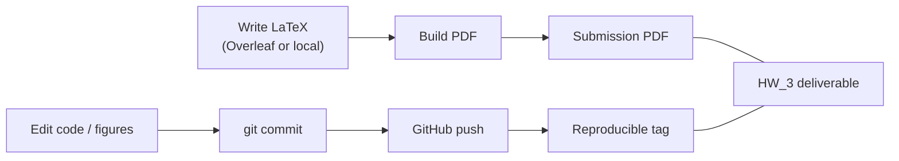

# Git + Overleaf workflow

```mermaid
flowchart LR
  A["Write LaTeX\n(Overleaf or local)"] --> B["Build PDF"]
  C["Edit code / figures"] --> D["git commit"]
  D --> E["GitHub push"]
  B --> F["Submission PDF"]
  E --> G["Reproducible tag"]
  F --- H["HW_3 deliverable"]
  G --- H
```

Caption: Keep **code** and **paper** evolving together; tag releases that match homework due dates.
