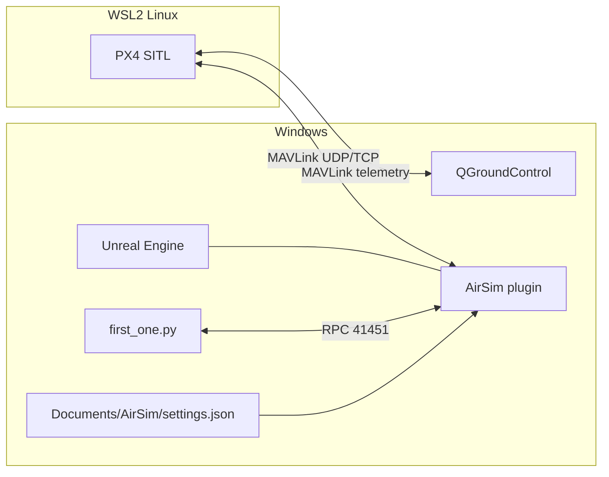

# HW_3 runtime communication (PX4 - AirSim - Unreal - QGroundControl)

Caption: `first_one.py` reads images + detections through AirSim RPC, while PX4 and QGroundControl communicate through MAVLink.
