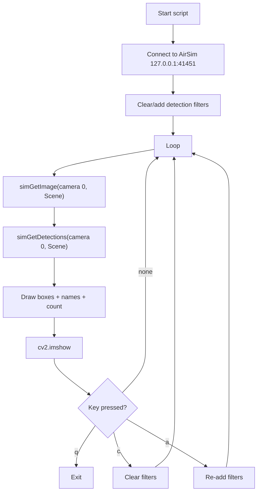

# HW_3 first_one.py processing loop

```mermaid
flowchart TD
  start["Start script"] --> conn["Connect to AirSim 127.0.0.1:41451"]
  conn --> filt["Clear/add detection filters"]
  filt --> loop["Loop"]
  loop --> img["simGetImage(camera 0, Scene)"]
  img --> det["simGetDetections(camera 0, Scene)"]
  det --> draw["Draw boxes + names + count"]
  draw --> show["cv2.imshow"]
  show --> key{"Key pressed?"}
  key -->|q| stop["Exit"]
  key -->|c| clear["Clear filters"]
  key -->|a| add["Re-add filters"]
  clear --> loop
  add --> loop
  key -->|none| loop
```

Caption: Each frame fetches camera image and detections, overlays results, and updates object count in real time.
