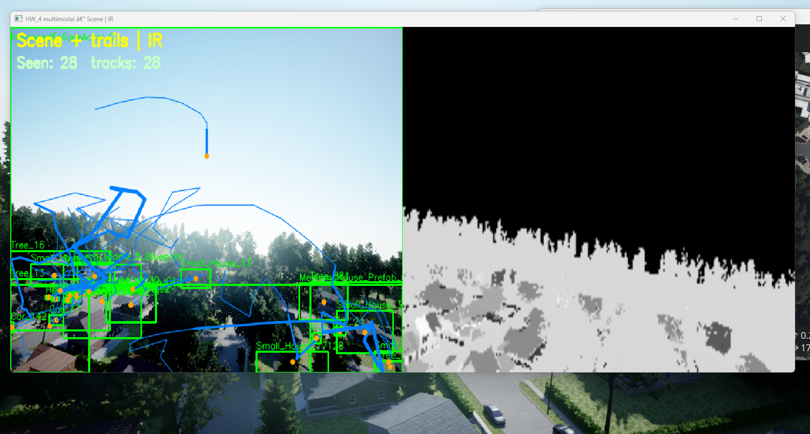
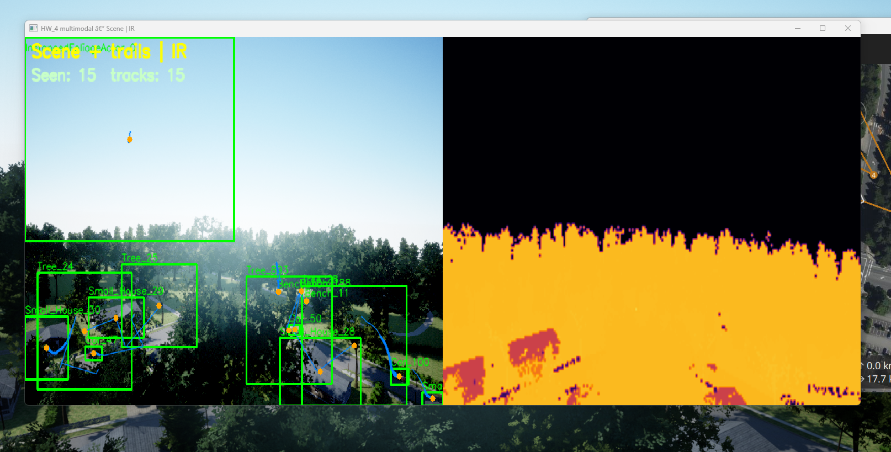

# HW_4 — Simulation integration & baseline computer vision

## Objective

Demonstrate an **end-to-end loop**:

1. **PX4 SITL** + **Unreal/AirSim** (environment running in **Play** mode).
2. **QGroundControl** (optional) for missions / telemetry.
3. **Python** client: live **front camera** stream + **AirSim detection API** (`simGetDetections`) with **OpenCV** visualization.

## Primary code artifacts

| File | Role |
|------|------|
| [`../../AirSim/PythonClient/detection/find_things_cv.py`](../../AirSim/PythonClient/detection/find_things_cv.py) | Connects to AirSim, draws bounding boxes and labels |
| [`../../AirSim/PythonClient/detection/ADD_NEW_OBJECT_TYPE.md`](../../AirSim/PythonClient/detection/ADD_NEW_OBJECT_TYPE.md) | How Unreal names map to `OBJECTS_TO_FIND` wildcards |
| [`../../RUN_DRONE_FIND_THINGS.md`](../../RUN_DRONE_FIND_THINGS.md) | Run order (PX4 → Unreal → QGC → script) |

## How to run (short)

```powershell
cd ..\..\AirSim\PythonClient\detection
.\venv310\Scripts\python.exe find_things_cv.py
```

Configure **`OBJECTS_TO_FIND`** (e.g. `Car*`, `House*`) to match **World Outliner** names in your level.

## Concepts for the report

- **Detection is name-based:** AirSim filters by **actor / mesh name patterns**, not color.
- **Camera:** default front camera id `"0"`; image type **Scene**.
- **Port:** RPC to localhost (example **41451**; confirm in your `settings.json` if customized).

## Diagrams

| File | Description |
|------|-------------|
| [diagrams/01_data_flow_hw4.md](diagrams/01_data_flow_hw4.md) | Camera image + detection JSON RPC |
| [diagrams/02_detection_filter_logic.md](diagrams/02_detection_filter_logic.md) | From `OBJECTS_TO_FIND` to on-screen boxes |
| [diagrams/03_multimodal_sensors.md](diagrams/03_multimodal_sensors.md) | RGB + infrared (+ optional depth) |
| [diagrams/04_image_motion_trails.md](diagrams/04_image_motion_trails.md) | 2D motion trails in the image |

---

## Advanced track (HW_4) — ideas your teacher will notice

These extend the baseline **without** requiring a full SLAM thesis. Tie each bullet to **one figure** in your report.

### A) Infrared “graphics” (thermal-style view)

- Request a second stream: `airsim.ImageType.Infrared` for the **same** `camera_name` (`"0"`).
- Show **side-by-side** windows: Scene \| Infrared, or **false-color** IR in OpenCV (`applyColorMap`).
- **Why it matters:** shows you understand **multi-modal sensing**; IR in Unreal is simulated brightness, not real physics, but the **pipeline** is the same as real sensors.

### B) Motion diagram (2D, in camera space)

- Every frame, compute the **centroid** of each detection box `(u, v)`.
- **Associate** detections across frames (simple: greedy nearest-centroid, or IoU match for same class name).
- Draw a **polyline** (last *K* points) overlaid on the video — classic “motion diagram” look.

### C) Instrument the loop (for HW_5 mapping)

- Log to CSV: `timestamp`, `u, v`, `name`, optional `box area`.
- This becomes the bridge to **world points** later when you add drone pose (HW_5).

### D) Optional depth for one “ground point” demo

- Add `DepthPlanar` (or `DepthPerspective`) for the same camera.
- Pick the **center pixel** of a detection ROI and back-project to a **single 3D ray**; intersect with a flat ground plane at known altitude — yields one `(x,y)` sample per object (stretch but impressive if documented clearly).

### Suggested libraries

- **OpenCV** only is enough for A + B + D basics.
- **NumPy** + **matplotlib** for offline plots if you export CSV.

AirSim image types: [Image APIs](https://microsoft.github.io/AirSim/image_apis/)

---

## Implemented script (HW_4 advanced)

| File | What it does |
|------|----------------|
| [`multimodal_view.py`](multimodal_view.py) | **Scene + Infrared** side-by-side, orange **motion trails** on RGB, optional CSV of `(track_id, u, v)` |

### Run

```powershell
cd c:\Users\Selysecr\Desktop\Drons
.\AirSim\PythonClient\detection\venv310\Scripts\python.exe ALL_HW\HW_4\multimodal_view.py
.\AirSim\PythonClient\detection\venv310\Scripts\python.exe ALL_HW\HW_4\multimodal_view.py --csv ALL_HW\HW_4\trails_log.csv
```

**Keys:** `q` quit · `c` clear filters · `a` restore filters · `t` toggle IR false-color (`COLORMAP_INFERNO`).

Uses the same **`AIRSIM_DETECT_FILTERS`** env var as `first_one.py` (comma-separated patterns).

### Step-by-step: how `multimodal_view.py` works

Read this in order; each step matches what the program does on one pass through the file.

1. **Paths and AirSim import.** The script adds `Drons/AirSim/PythonClient` to `sys.path`, then imports `airsim`. That is the same pattern as `first_one.py`, so the interpreter finds the AirSim Python client next to your repo root (`ROOT` = two folders above `ALL_HW/HW_4`).

2. **Constants.** It uses camera id `"0"`, **Scene** images for detections and drawing, and **Infrared** for the second pane. The detection search radius is set in centimeters (`DETECTION_RADIUS_CM`). Connection defaults: IP `127.0.0.1`, port `41451` (change in code if your `settings.json` differs).

3. **Which objects to detect.** `objects_to_find()` returns either `DEFAULT_OBJECTS_TO_FIND` (wildcards like `Car*`, `Bench*`) or, if set, the comma-separated list in the environment variable **`AIRSIM_DETECT_FILTERS`**.

4. **`main()` — connect and register filters.** It builds an `MultirotorClient`, calls `confirmConnection()`, then `setup_filters()`: clear old mesh filters for that camera and image type, set radius, then `simAddDetectionFilterMeshName` for each pattern. Only actors whose names match those patterns can appear in `simGetDetections`.

5. **Optional CSV.** If you pass `--csv path`, it opens (or appends to) that file, writes a header row on first creation, and will log one row per **associated** or **new** track each logging frame (see below). Rows contain: wall-clock time, `track_id`, mesh `name`, centroid `u`, `v`, and `n_detections` that frame.

6. **Tracking state.** `tracks` is a list of dictionaries. Each track has: numeric `id`, current centroid `u`, `v`, latest `name`, and `trail` (a `deque` of integer pixel positions, max length from `--trail-len`, default 40). `next_tid` assigns fresh ids for detections that could not be matched to an existing track.

7. **Main loop — grab images.** Every iteration:
   - `simGetImage(..., Scene)` → decode with OpenCV → `rgb`.
   - `simGetImage(..., Infrared)` → decode → `ir_raw` (may be `None` if IR is unavailable).
   - If RGB failed, the loop `continue`s (skip the rest of the frame).

8. **Detections → measurements.** `simGetDetections(camera, Scene)` returns a list of detections. `measurements_from_detections()` turns each box into a small dict: mesh `name`, box corners `x0,y0,x1,y1`, and centroid **`u, v`** (average of min/max in x and y). Trails and matching use **centroids**, not full boxes.

9. **Match this frame to previous tracks.** `match_greedy(tracks, meas, max_dist)` (threshold from `--match-dist`, default 90 pixels):
   - For **each current measurement** in order, find the **nearest unused** previous track in image space (`hypot(Δu, Δv)`), but only if that distance is below `max_dist`.
   - Each track can be paired at most once; each measurement picks at most one track.
   - This is a simple **greedy** association: fast, good enough for small motion between frames; it is **not** a Kalman filter or identity across occlusions.

10. **Update or create tracks.** For each matched pair, the track’s `u`, `v`, `name` are updated, and the new centroid is appended to `trail`. Unmatched measurements spawn **new** tracks with a new `id` and a one-point trail. **Unmatched old tracks are dropped** (there is no coasting): `new_tracks` only contains matches plus new tracks, then `tracks = new_tracks`.

11. **CSV logging.** Whenever a track is updated or created, if `--csv` is on, one line is written (and the file flushed each frame). So the log reflects *tracks you are currently keeping*, not every raw detection if it failed to match (new tracks still get a line).

12. **Draw on RGB.** On a copy of the RGB frame:
   - Green rectangles and labels from **current** `meas` (all detections this frame).
   - For each track, orange **polylines** connect consecutive trail points (line thickness grows slightly along the trail), and a filled circle marks the **latest** position.

13. **Infrared pane.** `prepare_ir_display()` scales IR height to match RGB. If IR is missing, it shows a gray placeholder. If **`t`** was used to toggle, IR is converted to grayscale and `applyColorMap(..., INFERNO)` for false color; otherwise raw BGR IR is shown. Width is resized to match the RGB width so the two halves align.

14. **Show and handle keys.** `np.hstack` builds **left = Scene + trails**, **right = IR**. Overlay text shows counts. **`q`** exits. **`c`** clears detection filters in AirSim (you will see no boxes until **`a`** re-adds the patterns). **`t`** toggles IR false-color.

15. **Cleanup.** On exit (`finally`), the CSV file is closed and OpenCV windows destroyed.

**Conceptual map:** *AirSim* gives RGB + IR + named 2D boxes → *OpenCV* draws boxes and paths → optional *CSV* stores `(time, track_id, u, v, name)` for later homework (e.g. mapping). The weak link is **association**: if objects cross or `match_dist` is wrong, ids can swap or trails jump—tune `--match-dist` and `--trail-len` for your fps and motion.

## Screenshots — `multimodal_view.py` (`../images/`)

These captures live next to other course assets in [`../images/`](../images/).

**Infrared / multimodal pane** — Scene + IR side-by-side (IR may be grayscale or false-color after pressing **`t`**):



*Simulated IR (right) matches the RGB camera pose; left shows live detections.*

**Motion trails** — RGB with green boxes, labels, centroid dots, and trail polylines connecting past centroids (`--trail-len` limits history):



*Each track keeps a short 2D path in image space; counts `Seen` / `tracks` reflect the current frame.*

### Optional extras (report / rubric)

If you still need generic “stack” figures:

- `unreal_play_drone.png` — simulator in Play.
- `opencv_detections.png` — any OpenCV detection window.
- `terminal_connected.png` — “Connected to AirSim” in the terminal.

## Rubric-friendly checklist

- [ ] Repro steps documented (cite `RUN_DRONE_FIND_THINGS.md` or restate).
- [ ] At least one figure with **captions** explaining what is detected and why names matter.
- [ ] Brief **failure modes** (no Play mode, wrong filters, stale detection filters — script clears on start).

## References

AirSim image & APIs: [AirSim docs — Image APIs](https://microsoft.github.io/AirSim/image_apis/)
