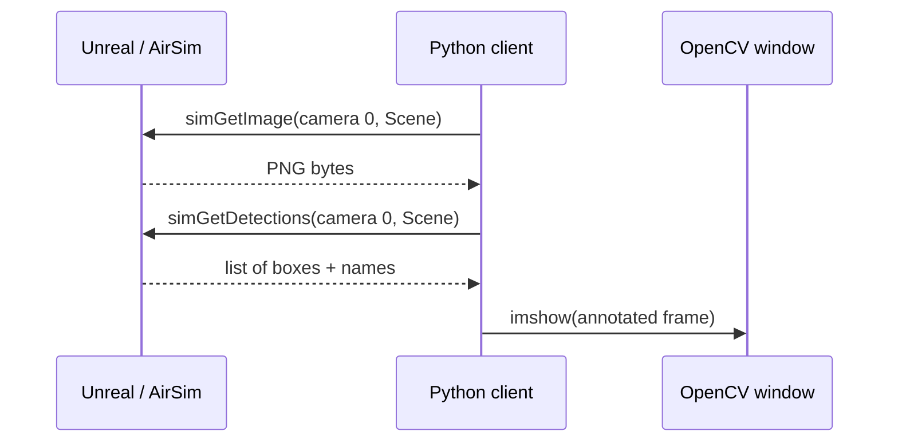

# Data flow — HW_4 baseline vision

```mermaid
sequenceDiagram
  participant UE as Unreal / AirSim
  participant PY as Python client
  participant CV as OpenCV window
  PY->>UE: simGetImage(camera 0, Scene)
  UE-->>PY: PNG bytes
  PY->>UE: simGetDetections(camera 0, Scene)
  UE-->>PY: list of boxes + names
  PY->>CV: imshow(annotated frame)
```

Caption: One loop iteration: fetch image, fetch detections, draw, display.
