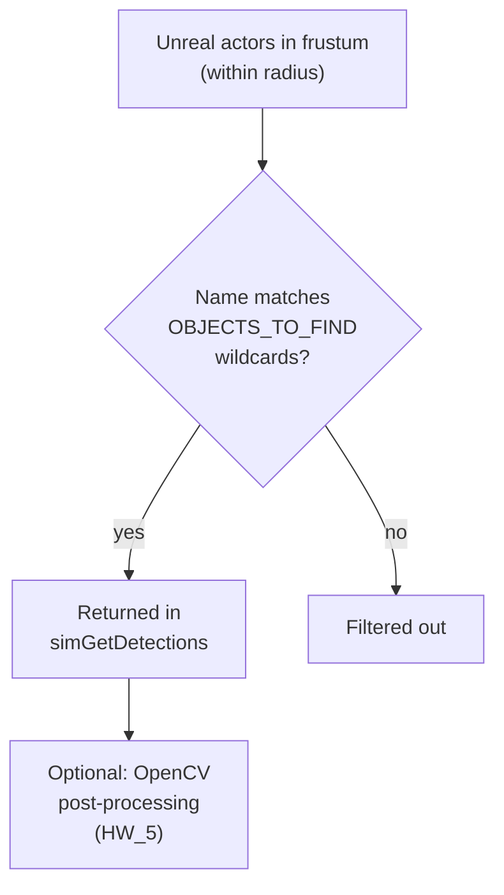

# Detection filter logic (conceptual)

```mermaid
flowchart TD
  A["Unreal actors in frustum\n(within radius)"] --> B{"Name matches\nOBJECTS_TO_FIND\nwildcards?"}
  B -->|yes| C["Returned in\nsimGetDetections"]
  B -->|no| D["Filtered out"]
  C --> E["Optional: OpenCV\npost-processing\n(HW_5)"]
```

Student caption: Wildcards like `Car*` require actor names such as `Car_58` in the level.
