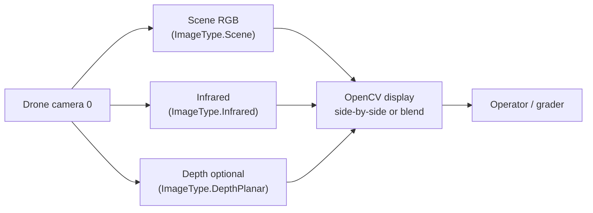

# HW_4 advanced — multi-modal sensing (RGB + infrared + optional depth)

Caption: AirSim can return **several image types per frame**. Infrared is useful for **contrast in foliage / low light** in Unreal; depth helps **ground intersection** for later mapping (HW_5).
