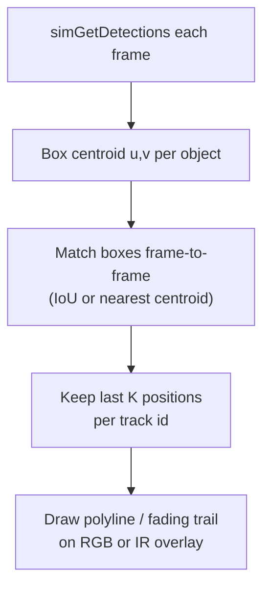

# HW_4 advanced — motion diagram in image space (2D trails)

Caption: A **motion diagram** in the camera view: each tracked object leaves a short **2D path** so reviewers see movement relative to the lens (not yet a world map).
