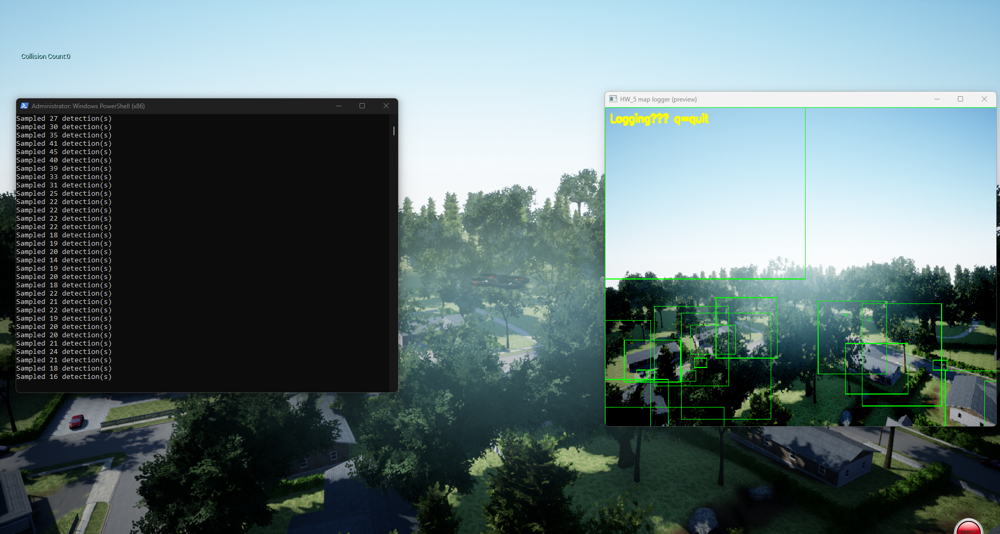
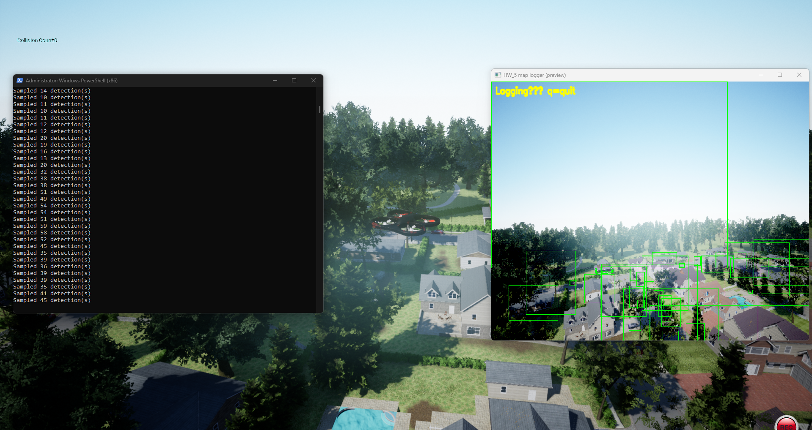

# HW_5 — Extensions: filtering, logging, navigation hook, ML path

## Objective

Go beyond name-only detection:

1. **Semantic filtering in pixels** (example: **red** vehicles when all cars share the `Car_*` name — HSV ROI check).
2. **Structured logging** (CSV: time, pose, boxes, flags).
3. **Optional navigation** (yaw toward largest detection — AirSim API; conflicts possible with manual/QGC control).
4. **Optional ML** (same feature vector for `train_detector.py` + sklearn model; **requires `scikit-learn` install**).

## Code map

| File | Role |
|------|------|
| [`../../AirSim/PythonClient/detection/find_things_cv.py`](../../AirSim/PythonClient/detection/find_things_cv.py) | Main script: filters, CSV, nav toggle, optional ML gate |
| [`../../AirSim/PythonClient/detection/detection_features.py`](../../AirSim/PythonClient/detection/detection_features.py) | 17-D feature vector (shared with trainer) |
| [`../../AirSim/PythonClient/detection/train_detector.py`](../../AirSim/PythonClient/detection/train_detector.py) | Train `.pkl` from `positive/` and `negative/` crop folders |

## Configuration knobs (teacher-friendly “methods” section)

- `OBJECTS_TO_FIND` — AirSim name wildcards.
- `FILTER_RED_CARS_ONLY` — HSV red fraction gate on `Car*` boxes.
- `LOG_ENABLE`, `LOG_DIR`, `LOG_EVERY_SEC` — CSV traces.
- `NAV_TRACK`, `NAV_YAW_GAIN_DEG` — press **`t`** in OpenCV to toggle.
- `ML_MODEL_PATH`, `ML_GATE_PREFIX`, `ML_THRESHOLD` — sklearn gate (optional).

## Diagrams

| File | Description |
|------|-------------|
| [diagrams/01_pipeline_hw5.md](diagrams/01_pipeline_hw5.md) | Extended pipeline |
| [diagrams/02_ml_optional_path.md](diagrams/02_ml_optional_path.md) | Crops → train → `.pkl` → runtime |
| [diagrams/03_world_to_map_points.md](diagrams/03_world_to_map_points.md) | From detections + pose to world points |
| [diagrams/04_sparse_map_outputs.md](diagrams/04_sparse_map_outputs.md) | Map visualization / export paths |

---

## Advanced track (HW_5) — infrared + motion + 3D “maps”

HW_5 can be positioned as **perception + mapping**: sparse semantic map of objects seen from the air.

### A) Infrared + RGB fusion (presentation-grade graphics)

- Run **two image requests per loop** (`Scene`, `Infrared`) aligned by timestamp (same frame index per tick).
- Build a **composite**: IR as luminance, Scene as tint; or side-by-side dashboard with shared detection boxes (boxes from Scene projections applied to IR if resolutions match).
- Add a **legend** in the report: what IR intensity means in your Unreal materials.

### B) Motion diagrams at two levels

1. **Image motion (2D):** extend HW_4 trails; color-code by object class (`Car` vs `House`).
2. **World motion (3D / 2.5D):** once you have world points per frame, plot **trajectory of each detected object** (jittery unless smoothed) — even a noisy plot is a strong **motion diagram** if you explain noise sources.

### C) Point placement — where objects are (core of “3D map”)

Use AirSim detection metadata:

- `DetectionInfo.relative_pose` — pose of the detected actor **relative to the camera (or sensor frame per AirSim version)**.
- `getMultirotorState().kinematics_estimated.pose` — drone pose in world frame.

**Pipeline (conceptual):**

1. Read detection → get **position** from `relative_pose.position` (or use `box3D` centers if you prefer).
2. Transform from **camera frame → world NED** using camera extrinsics + vehicle pose (use `simGetCameraInfo` for orientation if needed).
3. Append `(t, name, x, y, z)` to a running list → **sparse labeled point cloud**.

### D) What to plot (honest scope for a course project)

| Output | Difficulty | Looks impressive |
|--------|------------|------------------|
| Top-down scatter `(x,y)` colored by class | low–medium | yes |
| Matplotlib 3D scatter | medium | yes |
| Export `.ply` / `.csv` | medium | yes |
| Dense mesh reconstruction | high | optional stretch goal |

### E) Stretch goals (name them explicitly as future work)

- **Open3D** visualization (`pip install open3d`) — only if install is easy on your machine.
- **Occupancy grid** from depth images (discretize hits on ground).
- **Loop closure** — usually out of scope; say “not implemented.”

### Dependencies note

- 3D mapping needs careful **coordinate frame** discussion (NED vs ENU). Put one short subsection in your report with a diagram.
- If `relative_pose` interpretation is ambiguous, log raw values and cite AirSim version + docs.

### Implemented scripts (mapping track)

| File | What it does |
|------|----------------|
| [`world_map_points.py`](world_map_points.py) | Live preview + **CSV**: geo, `relative_pose`, vehicle pose, camera pose, **estimated** `est_world_x/y/z` = \(R_{cam} p_{rel} + t_{cam}\) |
| [`plot_map_2d.py`](plot_map_2d.py) | **`matplotlib`** top-down scatter from that CSV → PNG |

**Run logger:**

```powershell
cd c:\Users\Selysecr\Desktop\Drons
.\AirSim\PythonClient\detection\venv310\Scripts\python.exe ALL_HW\HW_5\world_map_points.py --csv ALL_HW\HW_5\map_points.csv --interval 0.25
```

**Plot:**

```powershell
.\AirSim\PythonClient\detection\venv310\Scripts\pip.exe install matplotlib
.\AirSim\PythonClient\detection\venv310\Scripts\python.exe ALL_HW\HW_5\plot_map_2d.py ALL_HW\HW_5\map_points.csv -o ALL_HW\HW_5\map_topdown.png
```

`est_world_*` is a **course-level** approximation — cite in your report if points need manual calibration.

## ML training (if network allows `pip install scikit-learn`)

```powershell
cd ..\..\AirSim\PythonClient\detection
.\venv310\Scripts\python.exe train_detector.py --positive crops\positive --negative crops\negative --out red_car_clf.pkl
```

If install fails, document the **network error** and rely on **HSV-only** filtering in the report (honest limitation).

## Deliverables checklist

- [ ] Explain **why** name-only detection is insufficient for “red car” (same `Car_*` label).
- [ ] Screenshot of **CSV** sample or describe columns (privacy: no secrets).
- [ ] One figure for **optional** nav or ML path.
- [ ] **Ethics / safety** one-liner: simulation-only; API control vs. pilot authority.

## Screenshots — HW_5 logger (`../images/`)

You added two real captures from `world_map_points.py` logging sessions:



*Live logger preview (right) with terminal sampling counts (left) while detections are written to CSV.*



*Second run from a different camera pose; green boxes confirm active mesh-name filtering and logging.*

### Optional extra report images

- `opencv_red_filter.png` — only red cars boxed (or best effort).
- `detection_logs_csv_snippet.png` — blurred path if needed.
- `optional_nav_track_overlay.png` — “NAV TRACK” text on frame.
