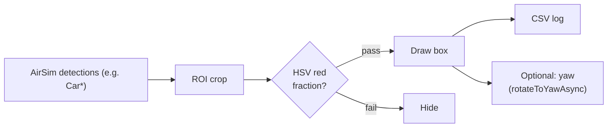

# Extended perception + logging pipeline

```mermaid
flowchart LR
  A["AirSim detections (e.g. Car*)"] --> B["ROI crop"]
  B --> C{"HSV red\nfraction?"}
  C -->|pass| D["Draw box"]
  C -->|fail| E["Hide"]
  D --> F["CSV log"]
  D --> G["Optional: yaw\n(rotateToYawAsync)"]
```

Caption: Hybrid **simulator geometry** (boxes) + **pixel statistics** (color gate) + **telemetry export**.
