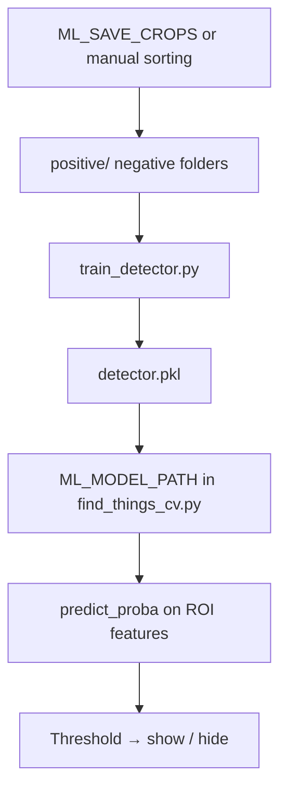

# Optional ML path

```mermaid
flowchart TD
  S["ML_SAVE_CROPS or manual sorting"] --> T["positive/ negative folders"]
  T --> U["train_detector.py"]
  U --> V["detector.pkl"]
  V --> W["ML_MODEL_PATH in find_things_cv.py"]
  W --> X["predict_proba on ROI features"]
  X --> Y["Threshold → show / hide"]
```

Caption: Features are defined in **`detection_features.py`** so training and runtime stay consistent.
