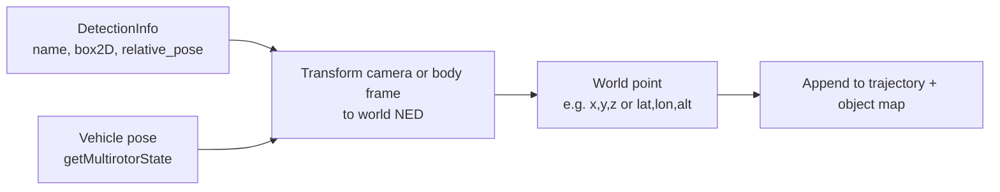

# HW_5 advanced — placing objects in world space (for 3D maps)

Caption: AirSim gives **relative_pose** per detection; combined with **drone pose**, you can estimate a **3D location** per object over time and accumulate a **sparse map**.
