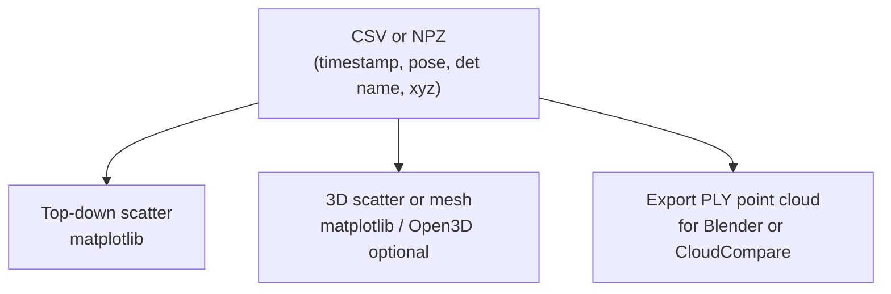

# HW_5 advanced — outputs for “3D map of the area”

Caption: Start with **sparse labeled points** (houses, cars, trees). Dense reconstruction (full mesh) is a stretch goal — document scope honestly in the report.
