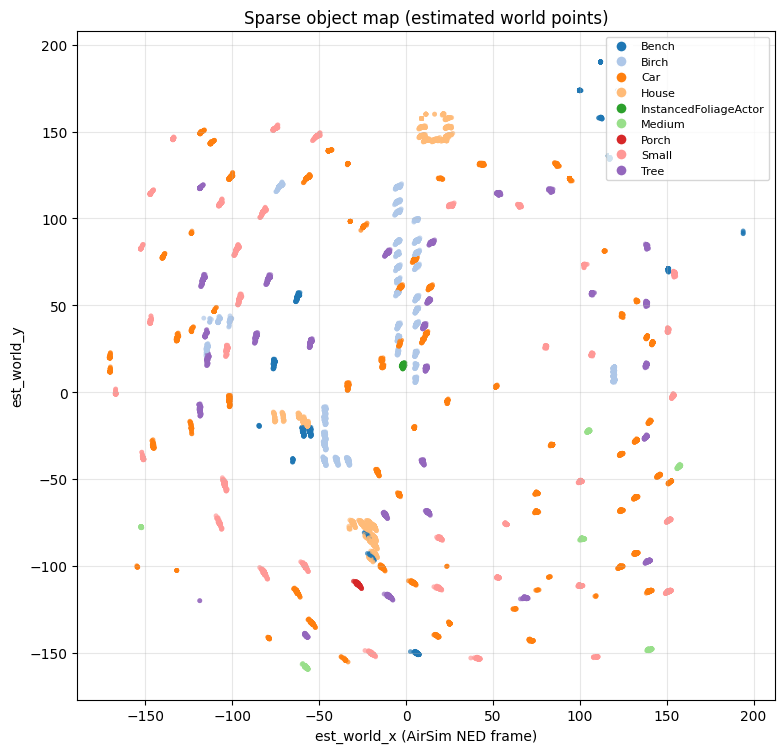

# Course submissions — Drone simulation and computer vision

This folder contains five homework milestones for the same project pipeline:
**PX4 SITL + Unreal/AirSim + (optional) QGroundControl + Python/OpenCV perception**.

Each homework has its own README with methods, diagrams, commands, and outputs.

---

## Homework index

| Folder | Main focus | Status / outputs |
|---|---|---|
| [HW_1](HW_1/README.md) | Setup, tooling, environment | Install flow and baseline environment notes |
| [HW_2](HW_2/README.md) | Research and communication architecture | Comm links, settings, and diagram updates |
| [HW_3](HW_3/README.md) | Baseline AirSim object detection | `first_one.py` and labeled detection screenshots |
| [HW_4](HW_4/README.md) | Multimodal view + 2D motion trails | `multimodal_view.py`, IR panel, trail CSV/logging |
| [HW_5](HW_5/README.md) | Sparse map points and top-down mapping | `world_map_points.py`, `plot_map_2d.py`, map PNG |

---

## Direct links to key outputs

### HW_4 (multimodal + trails)

- [HW_4 README](HW_4/README.md)
- [IR and scene side-by-side](images/HW_4_IR.png)
- [Detection trails view](images/HW_4_tails.png)
- [Trail log CSV](HW_4/trails_log.csv)

### HW_5 (map points + plotting)

- [HW_5 README](HW_5/README.md)
- [Logger screenshot 1](images/HW_5_map_points.png)
- [Logger screenshot 2](images/HW_5_map_points_2.png)
- [Top-down map figure](HW_5/map_topdown.png)
- [Raw map points CSV](HW_5/map_points.csv)

---

## Most important images (quick view)

### HW_4 — multimodal and trails

### HW_5 — map logging and final map

---

## Core scripts used in this submission

- `HW_3/first_one.py`
- `HW_4/multimodal_view.py`
- `HW_5/world_map_points.py`
- `HW_5/plot_map_2d.py`

---

## Repository roots (from project root `Drons`)

| Path | Role |
|---|---|
| `AirSim/PythonClient/detection/` | AirSim detection scripts, venv, training helpers |
| `RUN_DRONE_FIND_THINGS.md` | Reproducible run order |
| `README.md` | Project overview |

---

